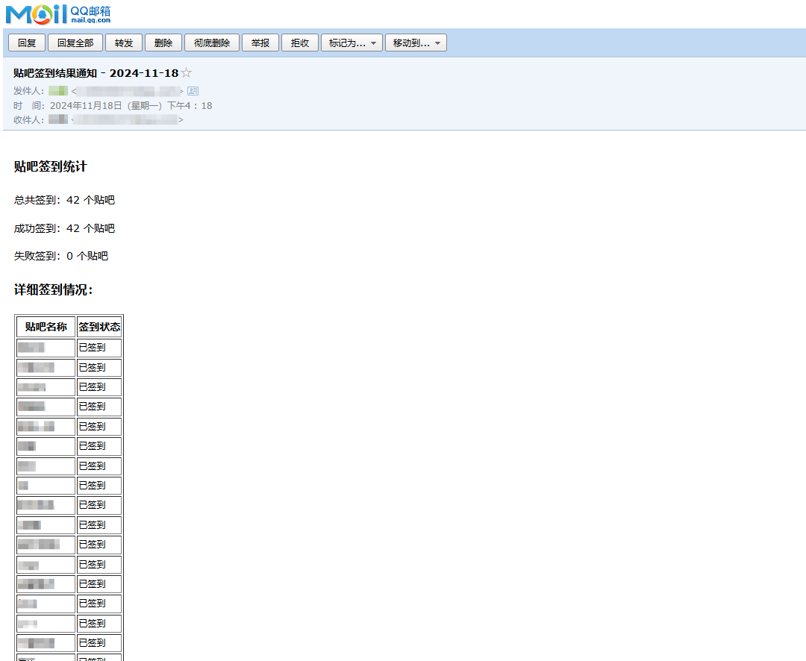

# 贴吧签到Github Action版

## 今日签到状态

## 二次开发

### 1. 主要特性
- 从 3.6 版本升级到 3.10 版本
- 随机时间区间执行工作流
- 加入随机用户代理池减少风控风险
- 自动优化线程池大小实现多线程并发签到
- 内置随机延迟，避免请求过快
- 加入多轮次签到，大大增加签到成功率
- 优化邮件发送服务，发送签到结果邮件
- 签到进度实时反馈

### 2. 多账户支持
- 支持同时添加多个百度账号
- 使用 `#` 分隔多个 BDUSS

### 3. 可配置性
- 所有关键参数都可在 `config.py` 中配置：
  - HTTP 请求设置（超时、重试次数等）
  - 线程池参数
  - 签到延迟范围
  - API 接口地址
  - 请求头信息

## 配置说明

主要配置项（在 `config.py` 中）：
- `MAX_WORKERS`: 最大线程数（默认20）
- `MIN_DELAY`/`MAX_DELAY`: 签到间隔时间（默认1-3秒）
- `TIMEOUT`: 请求超时时间（默认5秒）
- `RETRY_TIMES`: 重试次数（默认3次）

## 环境变量

当然也可以仅配置BDUSS，不配置其他6个邮件相关配置

| 变量名* | 说明 |
| --- | --- |
| BDUSS | xxxxxxxxxxx |
| SMTP_HOST | 邮件服务器地址 |
| SMTP_PORT | 邮件服务器端口 |
| SMTP_USER | 邮箱账号 |
| SMTP_PASS | 授权码/密码 |
| SENDER | 发件人地址 |
| RECEIVER | 收件人地址 |

## 使用说明

省流版指南：[ChatGPTNextWeb项目workflows配置说明](https://github.com/ChatGPTNextWeb/ChatGPT-Next-Web/blob/main/README_CN.md#%E4%BF%9D%E6%8C%81%E6%9B%B4%E6%96%B0)

1. Fork 本仓库，然后点击你的仓库右上角的 `Settings` -> `Secrets and variables` -> `Actions` 这一项，添加一个`Repository secrets`，变量名称为 `BDUSS`，支持同时添加多个帐户，BDUSS 之间用 `#` 隔开即可。

2. 设置好环境变量后点击你的仓库上方的 `Actions` 选项，第一次打开需要点击 `I understand...` 按钮，确认在 Fork 的仓库上启用 GitHub Actions 。

3. 任意发起一次commit，可以参考下图流程修改 `README.md` 文件。

- 打开`README.md`，点击 `Edit` 编辑按钮
- 修改任意内容，这里在末尾插入了空格，移动到最下面，点击提交

4. 至此自动签到就搭建完毕了，可以再次点击`Actions`查看工作记录，如果有`Baidu Tieba Auto Sign`则说明workflow创建成功了，点击右侧记录可以查看详细签到情况

